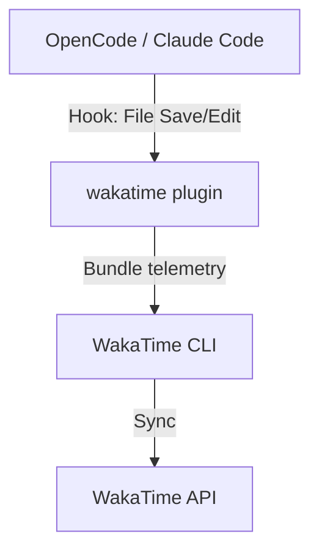

# wakatime

WakaTime integration for OpenCode and Claude Code. Automatically tracks coding time, project metrics, and language usage.

## Architecture

## Structure

- `src/` - Shared core logic (currently split into specific wrappers, to be unified)
- `claude/` - Claude Code specific wrappers
- `opencode/` - OpenCode specific wrappers
- `dist/` - Single compiled output supporting both environments

## License

MIT
